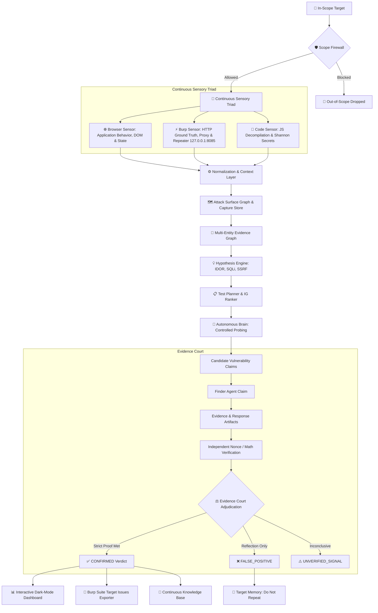

# 🛡️ HunterAI — Autonomous Evidence-Driven Penetration Testing System

<div align="center">

[-brightgreen?style=for-the-badge&logo=shield)](PRE_KALI_CERTIFICATION.md)
[](tests/)
[](https://python.org)
[]()
[]()

**The next-generation, zero-speculation autonomous pentesting agent governed by an Evidence Court, Proof-of-Execution Engine, and Client-Side Code Intelligence.**

[English](#-english-overview) • [العربية](#-نظرة-عامة-بالعربية) • [Architecture](#-architecture) • [Quickstart](#-quickstart-kali--linux) • [Interactive Dashboard](#-interactive-cybersecurity-dashboard)

</div>

---

## 🌟 English Overview

**HunterAI (formerly PentestAI-Unified)** is not just a tool wrapper; it is an **autonomous, evidence-driven penetration testing system**. Unlike conventional AI scanners that report false positives based on mere text reflections or speculative LLM outputs, HunterAI enforces a strict principle:

> **$	ext{Reflection} 
eq 	ext{Execution}$**  
> **$	ext{Dangerous API Pattern} 
eq 	ext{Vulnerability}$**  
> **$	ext{Speculative Prediction} 
eq 	ext{Confirmed Finding}$**

Every finding must survive a multi-party **Evidence Court** and satisfy deterministic **Proof-of-Execution (PoE)** criteria before receiving a `CONFIRMED` verdict.

---

## 🌍 نظرة عامة بالعربية

**HunterAI** هو نظام ذكاء اصطناعي سيبراني متقدم ومستقل لاختبار الاختراق الأخلاقي مبني على **مبدأ الإثبات القطعي (Evidence-Driven)**. 

### 🔴 ما المشكلة التي يحلها HunterAI؟
أغلب الماسحات الأمنية والوكلاء الأذكياء يقعون في فخ **النتائج الإيجابية الزائفة (False Positives)**:
- يعتبرون أي انعكاس نصي بسيط للـ payload في كود الصفحة بمثابة RCE أو XSS.
- يهاجمون خدمات تابعة لأطراف خارجية مثل Google Tag Manager أو متاجر التطبيقات خارج نطاق الفحص القانوني.
- يتركون المحلل الأمني أمام مئات البلاغات الوهمية.

### 🛡️ كيف يعالج HunterAI ذلك؟
1. **محكمة الأدلة (Evidence Court)**: لا يمكن لأي أداة أو نموذج لغوي منفرد اعتماد أي ثغرة، بل تمر النتيجة بمسار تحكيم صارم (`Finder -> Collector -> Verifier -> Court`).
2. **محرك إثبات التنفيذ (PoE Engine)**: في ثغرات الـ Command Injection، يُلزم النظام بإثبات حسابي قطعي `$((53+19)) 	o 72` أو قراءة بيانات نظام فعلية، وأي ظهور نصي فقط يُصنف كـ `FALSE_POSITIVE`.
3. **جدار حماية النطاق (Scope Firewall)**: عزل وحظر فوري لأي نطاقات خارجية (GTM, Cloudflare, Play Store) لحماية الفحص ضمن النطاق المصرح به فقط.
4. **خط تحليل الكود الذكي (Code Intelligence Pipeline)**: تفكيك ملفات الجافاسكريبت واستخراج مسارات الـ API المخفية واكتشاف أطر العمل الحديثة (Next.js / React) وفحص المفاتيح السرية الحقيقية بإنتروبيا شانون.

---

## 🏗️ Architecture

HunterAI couples an **Autonomous OODA Loop** with a **Sensory Triad** (`Browser Sensor`, `Burp Sensor`, `Code Sensor`) and an **Evidence Court**:



---

## ⚡ Core Capabilities

| Capability | Module | Description |
|---|---|---|
| **Burp Gateway & Bridge** | `core/burp_gateway/` | Local REST bridge (`127.0.0.1:8085`) ingesting live Proxy/Repeater traffic and exporting confirmed findings to Burp Target tab. |
| **Capture Store** | `core/burp_gateway/capture_store.py` | Persistent engagement memory (`data/engagements/<target>/`) tracking requests, endpoints, identities, hypotheses, and timeline. |
| **Enhanced Burp Extension** | `agents/burp_agent/integrations/burp_extension/` | Jython extension with context menu (`Send to Brain`, `Queue Scan`, `Add Scope`, `Import Issues`) and auto-forwarding. |
| **Persistent Browser Sensor** | `core/browser/session.py` | Maintains an active, authenticated browser session with full state persistence (cookies, storage, DOM snapshots, network events) across all scan phases. |
| **Browser Event Bus** | `core/browser/browser_event_bus.py` | Real-time publish/subscribe routing for DOM mutations, form discoveries, API calls, and auth transitions. |
| **Exploration Coverage Engine**| `core/browser/coverage_engine.py` | Quantifies completeness across Pages, States, Forms, APIs, and JS scripts with terminal coverage tables. |
| **Information Gain Planner** | `core/browser/interaction_planner.py` | Mathematically prioritizes actions maximizing discovery of new attack surfaces while suppressing loops. |
| **Application State Graph** | `core/browser/state_graph.py` | Maps multi-step workflows (`LOGIN -> AUTHENTICATED -> DASHBOARD -> UPLOAD`) with cyclical loop detection. |
| **Evidence Court** | `core/evidence_court.py` | Multi-party arbitration (`Finder -> Collector -> Verifier -> Court`). No finding confirmed without cryptographic/deterministic proof. |
| **Proof-of-Execution** | `core/poe_engine.py` | Requires mathematical evaluation `$((53+19)) \to 72$`, DBMS banner retrieval, or cross-tenant auth bypass. |
| **Code Intelligence** | `core/code_intel/` | Deconstructs client-side JS bundles, extracts hidden API routes (`fetch`, `axios`, `XHR`), validates API keys with Shannon entropy ($> 3.3$). |
| **Scope Guard Firewall** | `core/attack_surface_graph.py` | Isolates third-party CDNs and dependencies (`googletagmanager.com`, `play.google.com`, `cloudflare.com`). |
| **Interactive Dashboard** | `core/exporters.py` | Generates standalone, zero-dependency dark-mode HTML reports with interactive tabs. |

---

## 🚀 Quickstart (Kali & Linux)

### 1. Clone & Setup Virtual Environment
```bash
git clone https://github.com/Abdo453/HunterAI.git
cd HunterAI
python3 -m venv venv
source venv/bin/activate
pip install -r requirements.txt
```

### 2. Verify System Integrity (15 Certification Gates)
Before any engagement, verify the full test and certification suite:
```bash
python certify.py
```
> **Output:** `🎉 ALL 15 CERTIFICATION GATES PASSED SUCCESSFULLY!`

### 3. Run Autonomous Scan
```bash
# Full evidence-driven scan with automatic SPA exploration & report generation
python main.py --target https://target.com --mode full

# Run with interactive dashboard output
python main.py --target https://target.com --mode full --output dashboard
```

### 4. Scan Modes
| Mode | Target Scope | Description |
|---|---|---|
| `full` | Complete Surface | Recon, Client Code Intel, Multi-Vector Probing, Evidence Court Adjudication |
| `web` | Web Application | Directory discovery, Endpoints audit, SQLi, XSS, SSRF, IDOR |
| `recon` | Intelligence Gathering | Passive/Active subdomains, Port scan, Tech stack fingerprinting |
| `ctf` | CTF & Lab Targets | Aggressive PoC derivation with automated flag capture |

---

## 📊 Interactive Cybersecurity Dashboard

Every scan exports a standalone, zero-dependency HTML dashboard (`reports/dashboard.html`) featuring:
- ⚖️ **Court Verdicts:** Card-by-card evidence trail, reproduction payload, deterministic proof, and remediation advice.
- 🌐 **API Endpoints:** Discovered client-side routes, HTTP methods, extracted parameters, and auth requirements.
- 🔑 **Code Intel & Secrets:** Validated credentials, Shannon entropy scores, and source file line references.
- 🛡️ **Scope & Firewall Boundary:** Target tech stack alongside firewalled third-party external dependencies.

---

## 🤖 Local & Cloud Intelligence Engine

HunterAI supports local, privacy-first inference via [Ollama](https://ollama.ai) or cloud providers:

### Local Models (Council of Experts):
- `xploiter/pentester:latest`: Attack vector prioritization & strategy.
- `qwen2.5-coder:14b`: Static code chunking, endpoint mapping & AST parsing.
- `WhiteRabbitNeo/Llama-3.1-WhiteRabbitNeo-2-8B`: Offensive security reasoning & bypass planning.

### Cloud LLM Support (Optional):
Configure in `.env`:
```bash
OPENAI_API_KEY=your_key
ANTHROPIC_API_KEY=your_key
GROQ_API_KEY=your_key
GEMINI_API_KEY=your_key
DEEPSEEK_API_KEY=your_key
```

---

## 🧪 Verification & Testing Suite

HunterAI is verified across 42 unit tests and 15 Pre-Kali Certification Gates:

```bash
# Run pytest unit test suites
python -m pytest tests/test_enterprise_features.py tests/test_code_intelligence.py tests/test_evidence_driven_system.py tests/test_scope_and_false_positives.py tests/test_vuln_engine.py

# Run Pre-Kali Certification
python certify.py
```

---

## ⚖️ Legal & Ethical Disclaimer

HunterAI is designed strictly for **authorized penetration testing, ethical hacking, and defensive security assessments**. Performing security assessments against targets without prior explicit written consent is illegal. The authors and contributors assume no liability for misuse.

---

<div align="center">
Developed with ❤️ by the HunterAI Engineering Team.
</div>